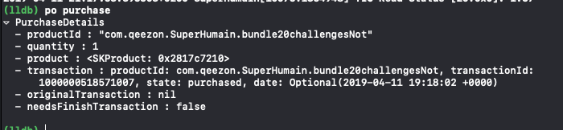
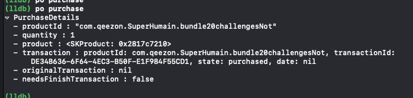
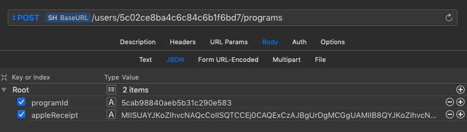

footer: © Arnaud Dupuy - 2019
slidenumbers: false

# *iOS* InApp purchase

---

## Consumable
## Non-Consumable
## Subscription

---

## Wait... 
## What's about retail apps

---

## Program

1. Build it
2. Test it
3. Improve it

--- 

## What's you'll need

- Mac
- iDevice
- Valid Apple developper program subscription

---

# GO

#### Open the xcode project and uncomment from MARK 1 to MARK 7

---

## Why purchase completed

Real (Sandbox)



Fake (LocalAppStore)



---

# How to prevent fake purchase
## Receipt verification

---

## 1. On device verification

``` swift
let appleValidator = AppleReceiptValidator(service: .production, sharedSecret: "your-shared-secret")
SwiftyStoreKit.verifyReceipt(using: appleValidator, forceRefresh: false) { result in
    switch result {
    case .success(let receipt):
        print("Verify receipt success: \(receipt)")
    case .error(let error):
        print("Verify receipt failed: \(error)")
    }
}
```

> Only use if you don't sync the app with API

---

## 2. Online
    - Revenuecat (Free Up to $10k)


---

## 3. Yourself
    - Node: in-app-purchase module



---

## 3. Yourself
    - Node: in-app-purchase module

``` js
const iap = require('in-app-purchase');

exports.validateiOS = async (receipt) => {
  iap.config({ applePassword: process.env.APPLE_RECEIPT_PASSWORD });
  try {
    await iap.setup();
    const response = await iap.validate(receipt);
    if (iap.isValidated(response)) {
      return response.receipt.in_app.map(purchase => purchase.product_id);
    }
    return [];
  } catch (error) {
    return [];
  }
};

```

---

## What's next to do

- Restore purchase
- Purchase from the app store
- Protect purchase restore with user identifier

---

# Be rich


---

# Questions?

### [Source + Slide](https://github.com/arnaud512/MakeMeRichDemoApp)